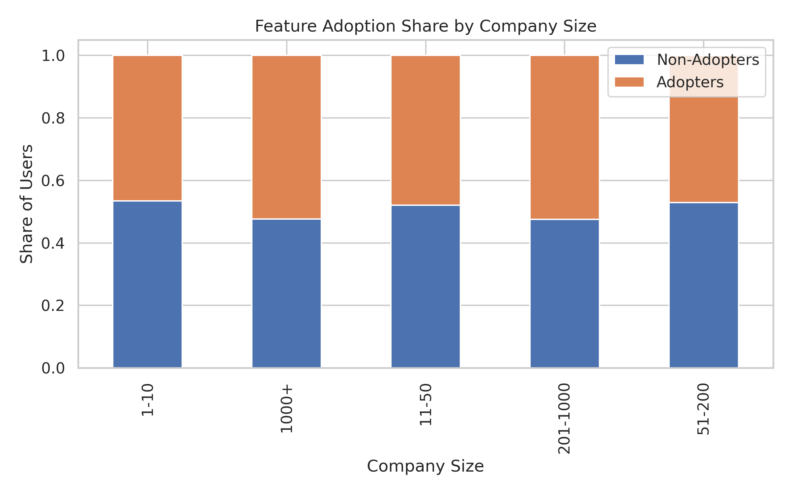
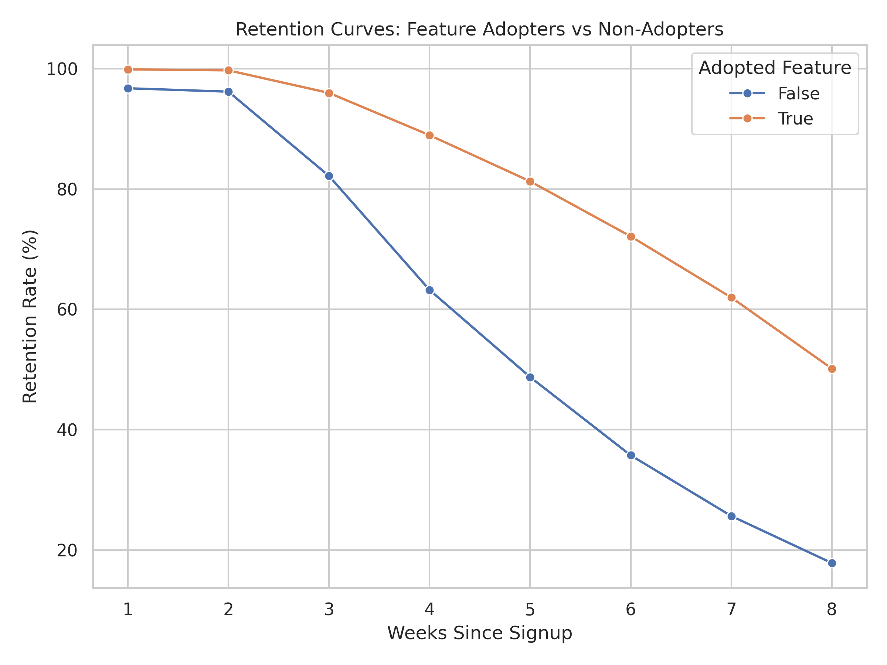
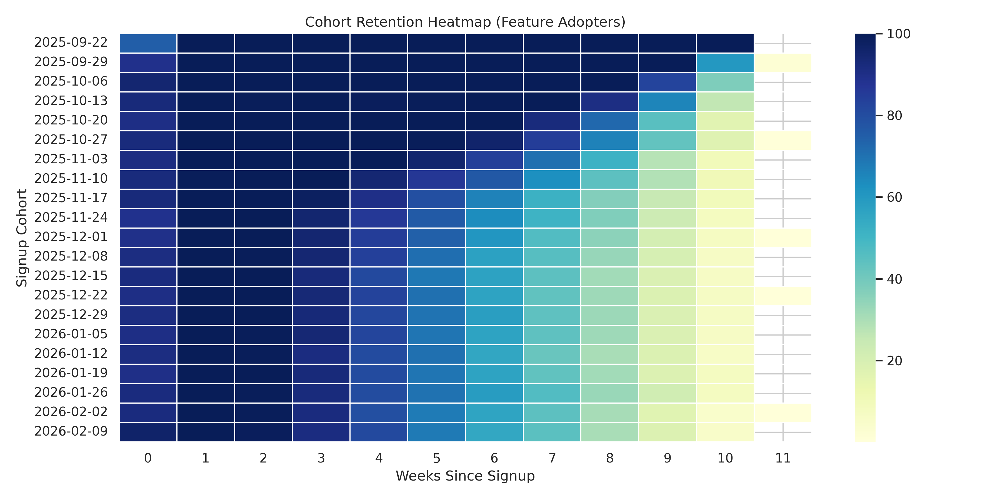
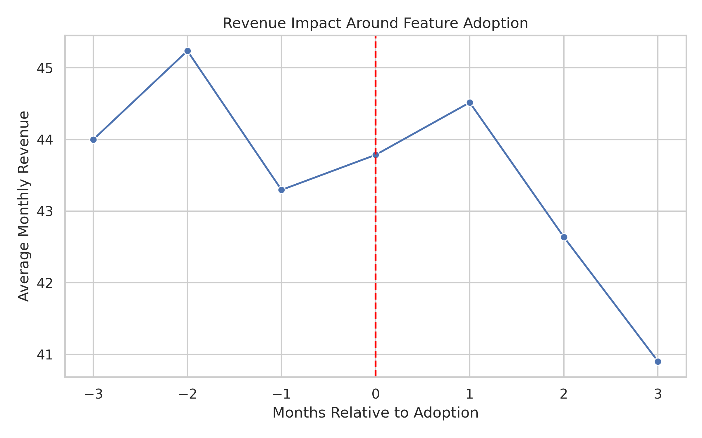

# Product Feature Adoption and Revenue Impact Analysis

## Overview

This project analyzes the impact of a newly launched **team collaboration feature** in a SaaS collaboration platform.

The goal is to determine whether the feature improves:

- user adoption
- user retention
- subscription revenue

The analysis replicates a **real-world product analytics workflow** including data cleaning, cohort analysis, feature adoption metrics, retention analysis, and revenue impact evaluation.

---

# Business Problem

A product manager asked:

> Does the new collaboration feature improve engagement and revenue, and should we invest further in it?

Key analytical questions:

- What percentage of users adopt the feature?
- How quickly do users adopt it after signup?
- Do adopters retain better than non-adopters?
- Does adoption increase subscription revenue?
- Are certain user segments more likely to adopt?

---

# Data Architecture

The project simulates a **modern SaaS analytics warehouse**.

### Raw Layer

raw.raw_events

### Core Layer

core.dim_users
core.dim_plans
core.dim_features
core.fct_sessions
core.fct_subscriptions
core.fct_billing_invoices

### Analytics / Mart Layer

marts.fct_feature_adoption
marts.mart_cohort_retention_weekly
marts.mart_feature_impact_summary
marts.mart_revenue_relative_to_adoption
marts.mart_user_engagement_tiers
marts.mart_user_week_retention

---

# Key Analyses

## Feature Adoption Funnel

This chart shows the progression of users from the total user base to feature eligibility and finally feature adoption.  
A high adoption rate among eligible users suggests strong feature interest and successful rollout.

---

## Retention Impact

Retention curves compare adopters and non-adopters over the first eight weeks after signup.  
Feature adopters consistently demonstrate higher retention rates, indicating the feature improves product engagement and user stickiness.

---

## Cohort Retention Heatmap

The cohort heatmap visualizes retention patterns across different signup cohorts.  
It helps identify lifecycle trends and shows how retention evolves over time for users who adopt the feature.

---

## Revenue Impact Around Adoption

Revenue trends are analyzed relative to the feature adoption event.  
While the feature does not immediately increase monthly revenue, it contributes to improved retention which is likely to increase long-term customer lifetime value.
---

# Key Findings

1. **Strong feature adoption**
   - ~87% of eligible users adopt the feature.

2. **Significant retention improvement**
   - Adopters retain **10–30 percentage points higher** across the first four weeks.

3. **Retention improvement persists after controlling for engagement**
   - Suggests the feature genuinely improves product stickiness.

4. **No immediate revenue increase**
   - Feature likely contributes to **long-term customer lifetime value rather than short-term ARPU growth**.

---

# Product Recommendation

Expand the feature rollout and improve onboarding flows to encourage earlier adoption.

The feature meaningfully improves retention, which is expected to increase long-term customer lifetime value.

---

# Tech Stack

SQL  
PostgreSQL  
Python  
Pandas  
Seaborn  
Matplotlib  
Jupyter Notebook

---

# Repository Structure

feature-impact-analysis/

sql/
data ingestion and transformation queries

src/
data generation and validation scripts

notebooks/
feature_impact_analysis.ipynb

docs/
executive_summary.md
metric_definitions.md
assumptions_and_limitations.md

outputs/
figures/

---

# Author

Taraka Ram Donepudi  
MS Computer Science — University of Michigan-Flint
